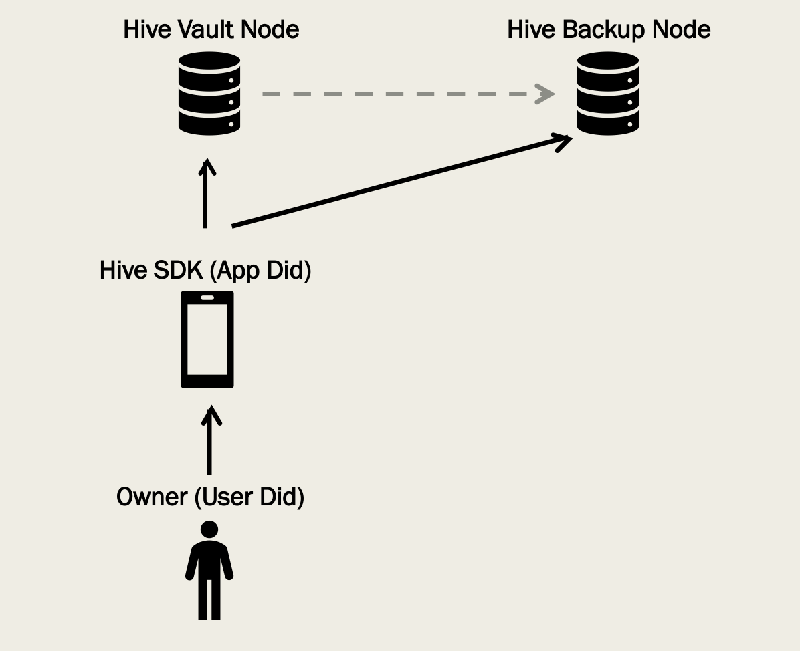
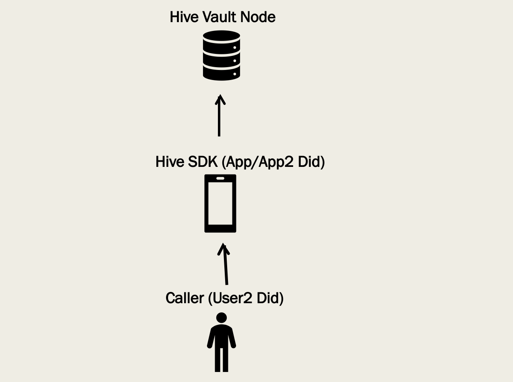

# Hive SDK Roles

As Hive environment design, some roles has been involved and have different responsibilities.

## Owner Use Vault

When user uses application, application will access data stored in Hive Node by Hive SDK. Hive Vault Node is used for store user application data which keep in database or file system. The relating pattern is like the followings.

User is called owner of the vault data. In vault node, the binding will be setup among owner user did, app did and vault data.

Owner can use FilesService and DatabaseService access vault data after get authorization token from vault node.

For security purpose, BackupService is used for backup all data to Hive Backup Node. With BackupService APIs, vault node will backup or restore data between vault node and backup node.

Some other services can also be used to control owner's data. Please check API documentation.

## Scripting Service

ScriptingService is used for other user (called caller) or other application access owner's vault data. It looks like this:

For caller, owner user did and relating app did are called target user did and target app did which are required for caller to access owner's vault data.

There are some scenarios to access owner's data.

1. Caller is owner and owns permission and application is another one.
2. Caller is another user and owns permission and application is owner application.
3. Caller is another user and owns permission and application is another application.
4. Vault supports anonymous access and caller is other user and application is another one.
