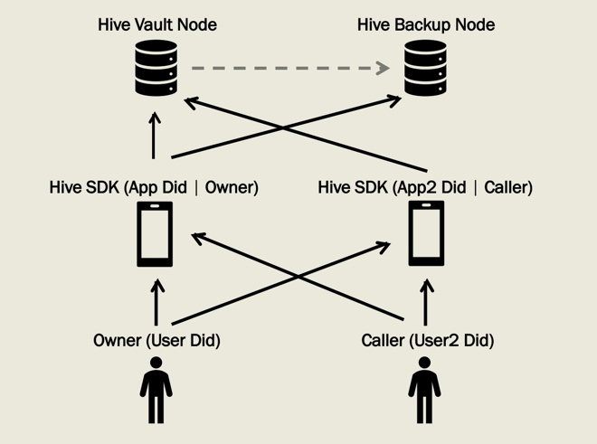

# Hive SDK Roles

For using hive sdk, some roles has been involved as the following pattern shows.

1. Hive Node: Hive Node works as Hive SDK backend service and takes two roles: vault and backup node. As designation, one user only have one vault node and one or more backup node.
   
- Hive Vault Node: Hive vault node is for keep application's user data which is stored in database or file system.

- Hive Backup Node: Used for backup Hive Vault Node data for security purpose. Backup data can also be restored to any vault node.

2. Hive SDK: Used for owner application and caller application. Every vault is related to specific user and application which is called owner user and owner application. Any other user or application is called caller.

3. User: User is identified by user DID. Different user DID will be treated as different user. As vault related to user DID and application DID, owner user and none-owner application will be also taken as caller.

- Owner: Vault data owner.

- Caller: Vault data caller who can use the other owner's vault data. To do this, owner must set permission for caller. Scripting service of Hive SDK is used for this.