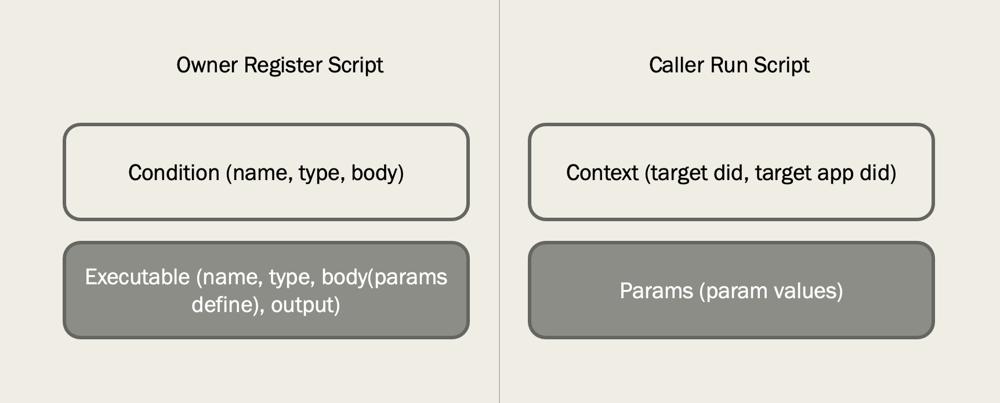

# Scripting Service Guide

As [roles](roles.md) shows, scripting service is used for accessing owner's data by other user or application.

Using script process is very easy: owner register script and caller run the script.

## Register

For registering, owner must define condition and executable. 

### Condition

Condition is used for setup caller's requirement before run script. Before run script, condition must be passed. Condition contains three types:

1. and: combines other conditions and every other conditions must be passed.
2. or: combines other conditions and any other conditions must be passed.
3. queryHasResults: this will count collection by a filter and passed when getting at least one result.

### Executable

Executable means script itself. This is business related. So different type has different meanings. There are nine type executable:

1. aggregated: Conjunct other type executables to one which can be executed all together.
2. find: query database collection.
3. insert: insert a document to database collection
4. update: update a document in database collection
5. delete: delete documents from database collection by filter
6. fileUpload: Upload a file to vault file system. This will create transaction id for the following uploading operation.
7. fileDownload: Download a file from vault file system. This will create transaction id for the following downloading operation.
8. fileProperties: Get file properties
9. fileHash: Get the hash code of the file content

### Variable

In some condition, we can use some prebuild variables to represent some values. The replacement will occur in running stage.

1. $caller_did: caller user did
2. $caller_app_did: caller application did

### Parameter

To define parameters when registering script, the following rule must be followed.

    $params.PARAMETER_NAME

*$params.path* defines a new parameter *path*. When run script, we just need set like this:

    path: "REAL_FILE_PATH"

*$params.path* will be replaced by *"REAL_FILE_PATH"*

## Run

To run script, context will tell script which data we need access. Params uses to pass real parameter values to script.
